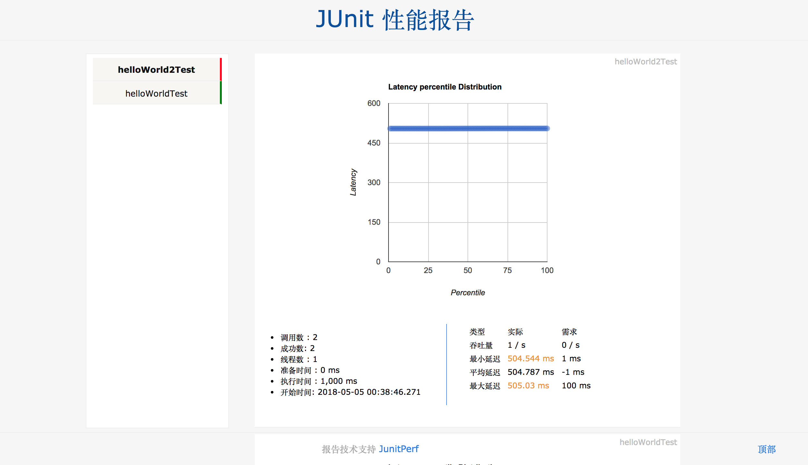
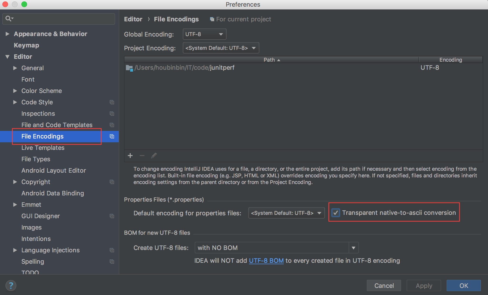

# junitperf

> [README-ENGLISH](README-EN.md)

[junitperf](https://github.com/houbb/junitperf) 是一款为 java 开发者设计的性能测试框架。

[](http://mvnrepository.com/artifact/com.github.houbb/junitperf)
[](https://www.travis-ci.org/houbb/junitperf)
[](https://github.com/houbb/junitperf/blob/master/LICENSE.txt)
[](https://github.com/houbb/junitperf)

## 为什么使用?

- 可以和 Junit5 完美契合。

- 使用简单，便于项目开发过程中的测试实用。

- 提供拓展，用户可进行自定义开发。

## 特性

- 支持 I18N

- 支持多种报告生成方式，支持自定义

- Junt5 完美支持，便于 Java 开发者使用

## 变更记录

[变更日志](CHANGELOG.md)

### v2.0.7 主要变更

1. 升级 heaven 依赖

# 快速开始

## 项目依赖

- jdk1.8 及其以上版本

- [Junit5](https://junit.org/junit5/) 及其以上版本

## maven 导入

```xml
<dependency>
    <groupId>com.github.houbb</groupId>
    <artifactId>junitperf</artifactId>
    <version>2.0.7</version>
</dependency>
```

## 入门案例

> [入门案例地址](https://github.com/houbb/junitperf/blob/master/src/test/java/com/github/houbb/junitperf/examples/HelloWorldTest.java)

- 使用例子

```java
public class HelloWorldTest {

    @JunitPerfConfig(duration = 1000)
    public void helloTest() throws InterruptedException {
        Thread.sleep(100);
        System.out.println("Hello Junit5");
    }

}
```

# 配置说明

## 测试注解指定

### @JunitPerfConfig

指定测试时的属性配置。(必填项)

| 属性 | 说明 | 类型 | 默认值 | 备注 |
|:----|:----|:----|:----|:----|
| threads | 执行时使用多少线程执行 | int | 1 | |
| warmUp | 准备时间 | long | 0 | 单位：毫秒 |
| duration | 执行时间 | long | 60_000(1分钟) | 单位：毫秒 |
| latencyStatistics | 统计实现 | StatisticsCalculator | DefaultStatisticsCalculator |  |
| reporter | 报告实现 | Reporter | ConsoleReporter |  |

使用如下：

```java
public class JunitPerfConfigTest {

    /**
     * 2个线程运行。
     * 准备时间：1000ms
     * 运行时间: 2000ms
     * @throws InterruptedException if any
     */
    @JunitPerfConfig(threads = 2, warmUp = 1000, duration = 2000)
    public void junitPerfConfigTest() throws InterruptedException {
        System.out.println("junitPerfConfigTest");
        Thread.sleep(200);
    }

}
```

### 各种报告的实现

这里主要是对于性能测试统计的**输出方式**。
支持以下方式：

| 方式 | 案例 |
|:----|:----|
| 默认方式 | [DefaultReporterTest](https://github.com/houbb/junitperf/blob/master/src/test/java/com/github/houbb/junitperf/examples/report/DefaultReporterTest.java) |
| 命令行 | [ConsoleReporterTest](https://github.com/houbb/junitperf/blob/master/src/test/java/com/github/houbb/junitperf/examples/report/ConsoleReporterTest.java) |
| HTML | [HtmlReporterTest](https://github.com/houbb/junitperf/blob/master/src/test/java/com/github/houbb/junitperf/examples/report/HtmlReporterTest.java) |
| 组合方式 | [MultiReporterTest](https://github.com/houbb/junitperf/blob/master/src/test/java/com/github/houbb/junitperf/examples/report/MultiReporterTest.java) |
| 自定义方式 | [DefineReporterTest](https://github.com/houbb/junitperf/blob/master/src/test/java/com/github/houbb/junitperf/examples/report/DefineReporterTest.java) |

### @JunitPerfRequire

指定测试时需要达到的要求。(选填项)

| 属性 | 说明 | 类型 | 默认值 | 备注 |
|:----|:----|:----|:----|:----|
| min | 最佳的运行耗时 | float | -1 | 最快的运行耗时如果高于这个值，则视为失败。单位：毫秒 |
| max | 平均的运行耗时 | float | -1 | 最坏的运行耗时如果高于这个值，则视为失败。单位：毫秒 |
| average | 平均的运行耗时 | float | -1 | 平均的运行耗时如果高于这个值，则视为失败。单位：毫秒 |
| timesPerSecond | 每秒的最小执行次数 | int | 0 | 如果低于这个最小执行次数，则视为失败。 |
| percentiles | 对于执行耗时的限定 | String[] | {} | percentiles={"20:220", "30:250"}。20% 的数据执行耗时不得超过 220ms;30% 的数据执行耗时不得超过 250ms; |

使用如下：

```java
public class JunitPerfRequireTest {
    /**
     * 配置：2个线程运行。准备时间：1000ms。运行时间: 2000ms。
     * 要求：最快不可低于 210ms, 最慢不得低于 250ms, 平均不得低于 225ms, 每秒运行次数不得低于 4 次。
     * 20% 的数据不低于 220ms, 50% 的数据不得低于 230ms;
     *
     * @throws InterruptedException if any
     */
    @JunitPerfConfig(threads = 2, warmUp = 1000, duration = 2000)
    @JunitPerfRequire(min = 210, max = 250, average = 225, timesPerSecond = 4, percentiles = {"20:220", "50:230"})
    public void junitPerfConfigTest() throws InterruptedException {
        System.out.println("junitPerfConfigTest");
        Thread.sleep(200);
    }

}
```

## 报告方式

### 命令行方式

大致如下：

```
[INFO] [2020-06-16 20:05:53.618] [c.g.h.j.e.HelloWorldTest.helloTest] - Started at:  2020-06-16 20:05:52.512
[INFO] [2020-06-16 20:05:53.619] [c.g.h.j.e.HelloWorldTest.helloTest] - Invocations:  9
[INFO] [2020-06-16 20:05:53.620] [c.g.h.j.e.HelloWorldTest.helloTest] - Success:  9
[INFO] [2020-06-16 20:05:53.620] [c.g.h.j.e.HelloWorldTest.helloTest] - Errors:  0
[INFO] [2020-06-16 20:05:53.621] [c.g.h.j.e.HelloWorldTest.helloTest] - Thread Count:  1
[INFO] [2020-06-16 20:05:53.623] [c.g.h.j.e.HelloWorldTest.helloTest] - Warm up:  0ms
[INFO] [2020-06-16 20:05:53.623] [c.g.h.j.e.HelloWorldTest.helloTest] - Execution time:  1000ms
[INFO] [2020-06-16 20:05:53.624] [c.g.h.j.e.HelloWorldTest.helloTest] - Throughput:  9/s (Required: -1/s) - PASSED
[INFO] [2020-06-16 20:05:53.625] [c.g.h.j.e.HelloWorldTest.helloTest] - Memory cost:  16byte
[INFO] [2020-06-16 20:05:53.635] [c.g.h.j.e.HelloWorldTest.helloTest] - Min latency:  100.191414ms (Required: -1.0ms) - PASSED
[INFO] [2020-06-16 20:05:53.635] [c.g.h.j.e.HelloWorldTest.helloTest] - Max latency:  105.2382ms (Required: -1.0ms) - PASSED
[INFO] [2020-06-16 20:05:53.636] [c.g.h.j.e.HelloWorldTest.helloTest] - Avg latency:  101.43268ms (Required: -1.0ms) - PASSED
```

### HTML 方式

页面如下：

后期会进行样式调整。



# 指定方法执行顺序

## 说明

方法的执行顺序会影响到最终的报告显示顺序。

如果你想严格指定同一个类方法的执行顺序，推荐使用 [Test Execution Order](https://junit.org/junit5/docs/current/user-guide/#writing-tests-test-execution-order) 的方式。

`@TestMethodOrder` 需要 junit5 在 5.4 及其以后版本

## 示例代码

参考 [OrderedHtmlTest](https://github.com/houbb/junitperf/tree/master/src/test/java/com/github/houbb/junitperf/examples/OrderedHtmlTest.java)

# 对于 junit4 的支持

## 引入 jar

```xml
<dependency>
    <groupId>com.github.houbb</groupId>
    <artifactId>junitperf</artifactId>
    <version>1.0.3</version>
</dependency>
```

## 相关文档

[junit4 相关使用](https://github.com/houbb/junitperf/tree/release_1.0.3)

# 友情提示

I18N 功能中的中文 properties 文件直接使用 `UTF-8` 格式。

如果你下载本项目进行测试，出现中文乱码。

## IDEA

idea 用户请勾选上图中的选项

【Setting】=》【File Encoding】勾选上 ascii 转换



# 关联开源框架

[data-factory 自动生成测试数据](https://github.com/houbb/data-factory)

[gen-test-plugin 自动生成测试案例的 maven 插件](https://github.com/houbb/gen-test-plugin)

# 后期 Road-MAP

- [X] 内存使用统计

- [ ] 支持线程的 sync 同步执行